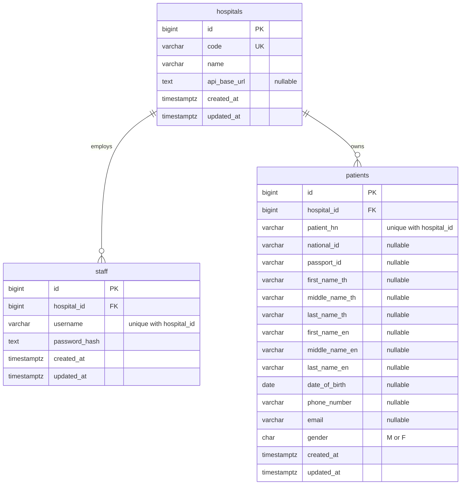

# Agnos Assignment API

Starter REST API written in Go with the Gin framework.

## Documentation

- [Assumptions and design decisions](docs/ASSUMPTIONS.md)
- [Postman collection](docs/Agnos%20Hospital%20Middleware%20API.postman_collection.json)

## Key assumptions

The complete rationale is in [Assumptions and design decisions](docs/ASSUMPTIONS.md).
The decisions most relevant when reviewing or running this project are:

- Hospital ownership is derived from the authenticated JWT, never from a client
  request field.
- PostgreSQL-generated `BIGINT IDENTITY` values are used for internal IDs;
  hospital codes, national IDs, and passport IDs are external identifiers.
- Patient search requires at least one non-empty condition and returns only
  records belonging to the authenticated staff member's hospital.
- A local Compose stack uses the Django Hospital A mock because the assignment
  does not provide a live Hospital A API. A cache miss by national ID or passport
  ID fetches the upstream record and persists its normalized form in PostgreSQL.

## Requirements

- Go 1.27.1 or newer
- Docker with Docker Compose

## Getting started

Run the complete stack behind Nginx:

```bash
cp .env.example .env
make stack-up
```

The public API listens on `http://localhost:8080` by default. Compose waits for
PostgreSQL, applies pending migrations, starts the API, waits for its readiness
check, and then starts Nginx.

For local Go development outside Docker:

```bash
make db-up
make migrate-up
go mod download
make run
```

```bash
curl http://localhost:8080/health
curl http://localhost:8080/health/ready
```

Expected response:

```json
{"status":"ready"}
```

## Database migrations

Migration files live in `migrations/` and are applied with Goose. The Go API
does not alter the database schema at startup. The Compose stack uses a separate
one-shot `migrate` container before starting the API.

```bash
make migrate-status # Inspect applied and pending migrations
make migrate-up     # Apply pending migrations
make migrate-down   # Roll back the latest migration
```

The first command may take longer because Go downloads and caches the pinned
Goose CLI version. To inspect the migrated tables from the command line:

```bash
docker compose exec postgres psql -U agnos -d agnos
```

## Create a staff member

```bash
curl --request POST http://localhost:8080/api/v1/staff/create \
  --header 'Content-Type: application/json' \
  --data '{
    "username": "staff01",
    "password": "password123",
    "hospital": "hospital-a"
  }'
```

The password is hashed with bcrypt before it is stored. Creating the same
username in the same hospital again returns `409 Conflict`.

## Staff login

```bash
curl --request POST http://localhost:8080/api/v1/staff/login \
  --header 'Content-Type: application/json' \
  --data '{
    "username": "staff01",
    "password": "password123",
    "hospital": "hospital-a"
  }'
```

A successful login returns a bearer token:

```json
{
  "data": {
    "access_token": "<jwt>",
    "token_type": "Bearer",
    "expires_in": 3600
  }
}
```

Protected endpoints expect `Authorization: Bearer <jwt>`. The token contains
the authenticated staff and hospital IDs used to enforce hospital data scope.
Set a strong `JWT_SECRET` outside local development.

## Search patients

```bash
curl --request POST http://localhost:8080/api/v1/patient/search \
  --header 'Content-Type: application/json' \
  --header 'Authorization: Bearer <jwt>' \
  --data '{
    "first_name": "Somchai",
    "date_of_birth": "1990-01-15",
    "page": 1,
    "page_size": 20
  }'
```

At least one search field is required. All supplied fields are combined with
`AND`, and `hospital_id` always comes from the authenticated token. The service
searches the local patient cache first. An identifier cache miss calls the
hospital HIS and stores the normalized response locally.

### Hospital A mock service

The assignment does not include a live Hospital A API, so the Compose stack starts
a small Django mock service named `hospital-a-mock`. Migration `00002` points the
seeded Hospital A record to `http://hospital-a-mock:8000`, which is resolvable only
inside the Compose network. It exposes:

```text
GET /patient/search/{national_id-or-passport_id}
```

Demo identifiers supplied by the mock:

```text
1103700123456  # Somchai Jaidee (national ID)
AA123456       # Jane Doe (passport ID)
```

Search one of these IDs with an authenticated Hospital A staff token. On the first
request, Agnos calls the Django service and caches the response in PostgreSQL. The
same request afterward is served from the local patient table.

## Commands

```bash
make run    # Start the API
make test   # Run tests
make fmt    # Format source code
make vet    # Run static checks
make build  # Build bin/api
make stack-up # Build and start Nginx, API, migrations, and PostgreSQL
make stack-down # Stop the complete Compose stack
make stack-logs # Follow logs for the complete stack
make db-up  # Start PostgreSQL
make db-down # Stop and remove the PostgreSQL container
make db-logs # Follow PostgreSQL logs
make migrate-up # Apply pending database migrations
make migrate-down # Roll back the latest migration
make migrate-status # Show migration status
```

## Project structure

```text
.
├── cmd/api/          # Application entry point
├── hospital-a-mock/  # Django mock of Hospital A's external API
├── internal/config/  # Environment configuration
├── internal/database/# PostgreSQL connection pool
├── internal/dto/     # HTTP request and response types
├── internal/handler/ # HTTP handlers
├── internal/his/     # Hospital Information System clients
├── internal/middleware/ # Authentication middleware
├── internal/model/   # Domain models
├── internal/repository/ # PostgreSQL queries
├── internal/security/ # Password and JWT utilities
├── internal/service/ # Business rules
├── migrations/       # Versioned PostgreSQL migrations
└── internal/router/  # Gin routes and middleware
```

## Database schema



Every staff member and patient belongs to one hospital. The database enforces
`UNIQUE (hospital_id, username)` for staff and `UNIQUE (hospital_id, patient_hn)`
for patients. National ID and passport ID are also unique within each hospital
when present.

## API specification

Base URL: `http://localhost:8080`

| Method | Path | Authentication | Description |
| --- | --- | --- | --- |
| `GET` | `/health` | No | Liveness check |
| `GET` | `/health/live` | No | Liveness check |
| `GET` | `/health/ready` | No | Readiness check, including PostgreSQL connectivity |
| `POST` | `/api/v1/staff/create` | No | Create a staff account |
| `POST` | `/api/v1/staff/login` | No | Authenticate a staff member and return a JWT |
| `POST` | `/api/v1/patient/search` | Bearer JWT | Search patients scoped to the authenticated hospital |

All errors use this shape:

```json
{
  "error": {
    "code": "VALIDATION_ERROR",
    "message": "human-readable explanation"
  }
}
```

### Create staff

`POST /api/v1/staff/create`

```json
{
  "username": "staff01",
  "password": "password123",
  "hospital": "hospital-a"
}
```

`username` must be 3–100 characters and `password` must be 8–72 characters.

Success — `201 Created`:

```json
{
  "data": {
    "id": 1,
    "username": "staff01",
    "hospital": "hospital-a",
    "created_at": "2026-09-26T00:00:00Z"
  }
}
```

| Status | Error code | When |
| --- | --- | --- |
| `400` | `VALIDATION_ERROR` | Missing, invalid, or unknown request field |
| `404` | `HOSPITAL_NOT_FOUND` | The supplied hospital code does not exist |
| `409` | `STAFF_ALREADY_EXISTS` | Username already exists in that hospital |
| `500` | `INTERNAL_ERROR` | Unexpected server error |

### Login

`POST /api/v1/staff/login`

```json
{
  "username": "staff01",
  "password": "password123",
  "hospital": "hospital-a"
}
```

Success — `200 OK`:

```json
{
  "data": {
    "access_token": "<jwt>",
    "token_type": "Bearer",
    "expires_in": 3600
  }
}
```

| Status | Error code | When |
| --- | --- | --- |
| `400` | `VALIDATION_ERROR` | A required field is missing or malformed |
| `401` | `INVALID_CREDENTIALS` | Username, password, or hospital is invalid |
| `500` | `INTERNAL_ERROR` | Unexpected server error |

### Search patients

`POST /api/v1/patient/search`

Required header:

```text
Authorization: Bearer <access_token>
```

Every search field is optional, but at least one non-empty field is required.
When multiple fields are supplied, all must match. `page` defaults to `1` and
`page_size` defaults to `20` (maximum `100`).

```json
{
  "national_id": "1103700123456",
  "first_name": "Somchai",
  "date_of_birth": "1990-01-15",
  "page": 1,
  "page_size": 20
}
```

Available fields: `national_id`, `passport_id`, `first_name`, `middle_name`,
`last_name`, `date_of_birth`, `phone_number`, `email`, `page`, and `page_size`.
The server obtains `hospital_id` from the JWT; clients cannot select another
hospital's data.

Success — `200 OK`:

```json
{
  "data": [
    {
      "first_name_th": "สมชาย",
      "middle_name_th": null,
      "last_name_th": "ใจดี",
      "first_name_en": "Somchai",
      "middle_name_en": null,
      "last_name_en": "Jaidee",
      "date_of_birth": "1990-01-15",
      "patient_hn": "A-HN-0001",
      "national_id": "1103700123456",
      "passport_id": null,
      "phone_number": "0812345678",
      "email": "somchai.jaidee@example.com",
      "gender": "M"
    }
  ],
  "pagination": {
    "page": 1,
    "page_size": 20,
    "total": 1
  }
}
```

| Status | Error code | When |
| --- | --- | --- |
| `400` | `VALIDATION_ERROR` | Invalid JSON, unknown field, or no search criteria |
| `401` | `UNAUTHORIZED` | Missing or invalid bearer token |
| `403` | `FORBIDDEN` | Token hospital scope is invalid |
| `502` | `HIS_UNAVAILABLE` | Hospital A cannot be reached on an identifier cache miss |
| `500` | `INTERNAL_ERROR` | Unexpected server error |

PostgreSQL state is stored in a Docker volume, so it remains available after
`docker compose down`. Use `docker compose down -v` only when you intentionally
want to delete the local database data.
